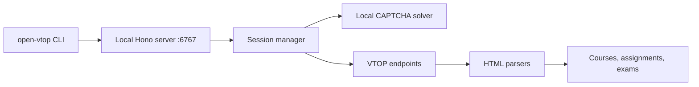

# Open VTOP

<div align="center">


An unofficial local VTOP client with automatic session handling, CAPTCHA solving, and a lightweight web dashboard.

</div>



## Features

- Saves credentials locally for repeat sessions.
- Handles login/session renewal and solves the VTOP CAPTCHA locally.
- Shows attendance/course data, assignments, and upcoming exams.
- Opens a browser-based dashboard on `localhost:6767`.
- Provides a logs command for troubleshooting.

## Run with a package executor

```bash
npx open-vtop
# or
bunx open-vtop
```

View logs:

```bash
npx open-vtop logs
```

## Develop locally

```bash
npm install
npm run build
npm start
```

Then open [http://localhost:6767](http://localhost:6767).

## Roadmap

- Timetable and calendar views.
- CGPA/grades view.
- Expanded course pages.

## Security and affiliation

Open VTOP is unofficial and is not affiliated with VIT. Credentials and session data are sensitive; use the tool only on a trusted machine and review the source before entering them. Portal changes can break parsers or login behavior.
